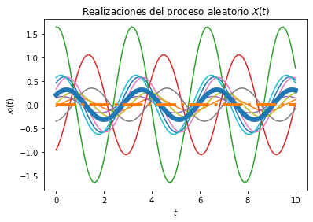
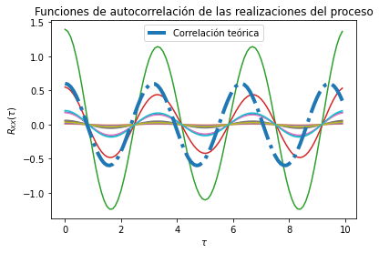

---

## Universidad de Costa Rica
### Escuela de Ingeniería Eléctrica
#### IE0405 - Modelos Probabilísticos de Señales y Sistemas

Segundo semestre del 2020

---

* Estudiante: **Jordileth Bonilla Segura**
* Carné: **B41083**
* Grupo: **02**

# `L4` - *Procesos Aleatorios*

Se decidió utilizar un valor de varianza, así como el valor de frecuencia angular "inicial" pequeños. Los valores medios son cero para ambas variabes aleatorias, así como el valor esperado. Como se aprecia, no es necesario hacer un cambio en las distribuciones utilizadas pues devuelven resultados  lo suficientemente buenos, pues el mapeo de la familia de curvas es coherente con lo estudiado en el tema 4. A continuación se muestran las gráficas obtenidas a partir del código del archivo L4.py: 

